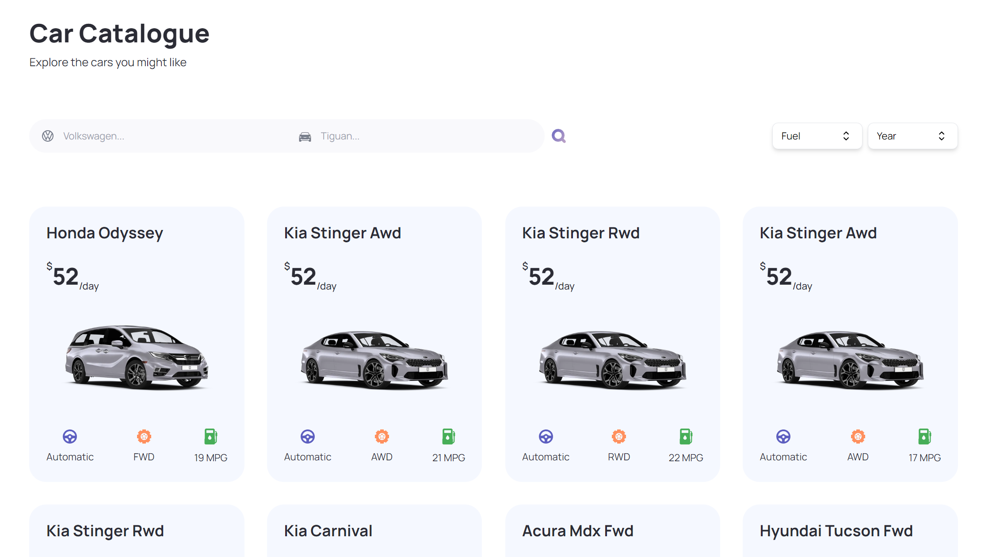

# Next.js-React.js-Tailwind-TS-CarHubApp

## Table of content

&nbsp;&nbsp;&nbsp; [About Project](#about-project)\
&nbsp;&nbsp;&nbsp; [Screenshots](#screenshots)\
&nbsp;&nbsp;&nbsp; [Technologies Used](#technologies-used)\
&nbsp;&nbsp;&nbsp; [Prerequisites](#prerequisites)\
&nbsp;&nbsp;&nbsp; [Installation](#installation)\
&nbsp;&nbsp;&nbsp; [Usage](#usage)\
&nbsp;&nbsp;&nbsp; [Acknowledgments](#acknowledgments)

## About Project

This is a Next.js and Tailwind based car hub app that using [Cars by API-Ninjas](https://rapidapi.com/apininjas/api/cars-by-api-ninjas/) and [Imagin Studio API](https://www.imagin.studio/car-image-api).

## Screenshots

Main screen

Filter screen

## Technologies Used

- Next.js
- React.js
- Tailwind.css
- TypeScript

## Prerequisites

You will need to have Node.js and npm installed on your machine.

## Installation

To get started with this project, follow the steps below:

1. Clone the repository to your local machine:\
   &nbsp;&nbsp;&nbsp;&nbsp;&nbsp;&nbsp; `git clone https://github.com/yshvchnk/Next.js-React.js-Tailwind-TS-CarHubApp.git`

2. Navigate to the project directory:\
   &nbsp;&nbsp;&nbsp;&nbsp;&nbsp;&nbsp; `cd Next.js-React.js-Tailwind-TS-CarHubApp`

3. Get your API keys [Cars by API-Ninjas](https://rapidapi.com/apininjas/api/cars-by-api-ninjas/) and [Imagin Studio API](https://www.imagin.studio/car-image-api) and set up environment variables

4. Install dependencies:\
   &nbsp;&nbsp;&nbsp;&nbsp;&nbsp;&nbsp; `npm install`

5. Start the development server:\
   &nbsp;&nbsp;&nbsp;&nbsp;&nbsp;&nbsp; `npm run dev`

## Usage

Open [http://localhost:3000](http://localhost:3000) with your browser to see the result.

You can start editing the page by modifying `app/page.tsx`. The page auto-updates as you edit the file.

## Acknowledgments

This is a [Next.js](https://nextjs.org/) project bootstrapped with [`create-next-app`](https://github.com/vercel/next.js/tree/canary/packages/create-next-app).

This project uses [`next/font`](https://nextjs.org/docs/basic-features/font-optimization) to automatically optimize and load Inter, a custom Google Font.
